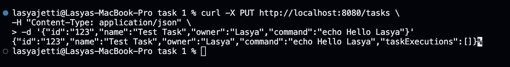
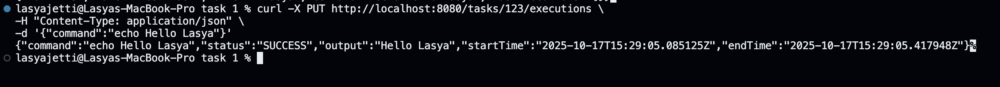
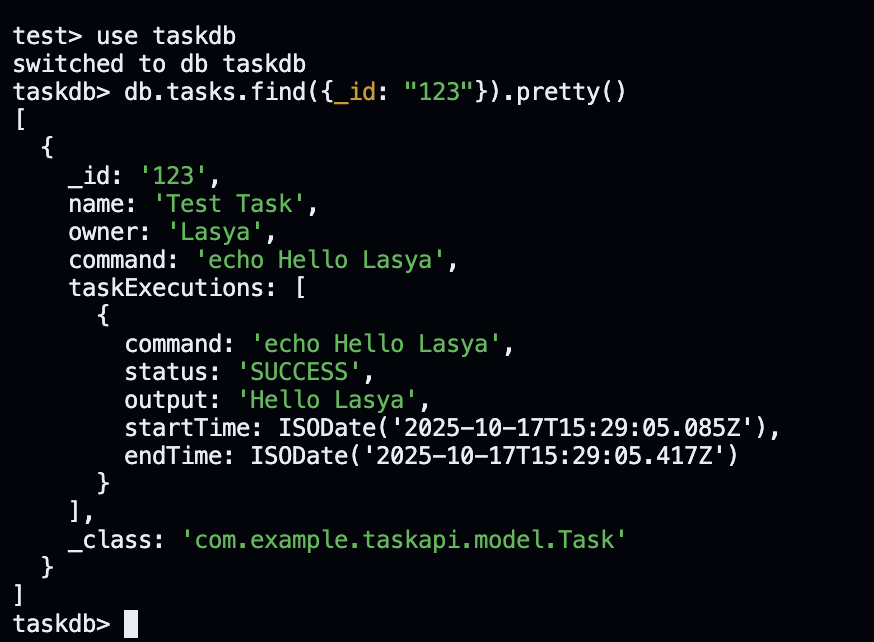
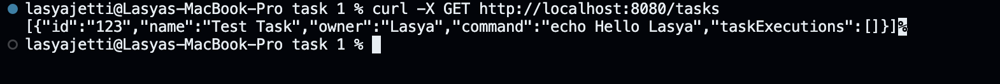
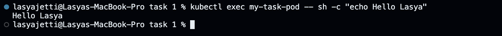
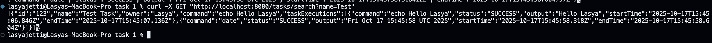
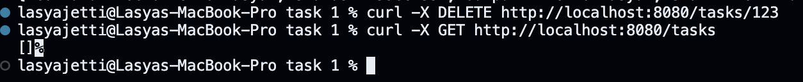

# Task 1 — Java REST API for Task Execution

### Description

This project is a Spring Boot REST API that manages and executes "Task" objects.  
Each task represents a shell command that can be executed locally or inside a Kubernetes pod.  
The tasks and their executions are stored in MongoDB.

---

### Features

- Create, retrieve, update, and delete tasks
- Execute shell commands safely
- Log task executions with timestamps, output, and status
- Store tasks and executions in MongoDB
- Execute commands inside Kubernetes pods (via `kubectl exec`)

---

### API Endpoints

| Method   | Endpoint                    | Description                  |
| -------- | --------------------------- | ---------------------------- |
| `GET`    | `/tasks`                    | Get all tasks                |
| `GET`    | `/tasks/{id}`               | Get task by ID               |
| `PUT`    | `/tasks`                    | Create or update a task      |
| `DELETE` | `/tasks/{id}`               | Delete task                  |
| `GET`    | `/tasks/search?name={name}` | Search task by name          |
| `PUT`    | `/tasks/{id}/executions`    | Run a task and log execution |

---

### Technologies

- Java 17
- Spring Boot
- MongoDB
- Kubernetes (Minikube)
- cURL for API testing

---

### 📸 Screenshots

#### 1️⃣ Creating a Task


→ This screenshot shows the curl command used to create a new task in the Task API. The API successfully stores the task details (id, name, owner, and command) in MongoDB.

#### 2️ Running a Task


→ This displays the execution of the task via PUT /tasks/{id}/executions. The response includes the command, its output, status (SUCCESS), and timestamps.

#### 3️ MongoDB Output


→ MongoDB view showing the stored task and its execution history, including command, status, output, and start/end times.

#### 4 Get Tasks


→ Displays all stored tasks retrieved from the MongoDB-backed REST API.

#### 5 Kubernetes Execution


→ Demonstrates the task running inside a Kubernetes pod using kubectl exec. The output "Hello Lasya" confirms successful command execution inside the cluster.

#### 6 Search Task


→ Returns all tasks whose name contains the string Test.

#### 7 Delete Task


→ Demonstrates successful deletion of a specific task using its unique ID.

---

### 🚀 How to Run

1. **Clone the repository**

```bash
   gh repo clone Jlasi17/task-1
   cd task-api
```

2. Start MongoDB
   Make sure MongoDB is running locally on the default port (27017).

```bash
    mongosh
```

3. Start Minikube (for Kubernetes executions)

```bash
   minikube start
```

4. Build and run the project
   This will download all dependencies automatically:

```bash
    mvn clean install
   mvn spring-boot:run
```

5. Test the API
   Use cURL, Postman, or any HTTP client to interact with the endpoints.
